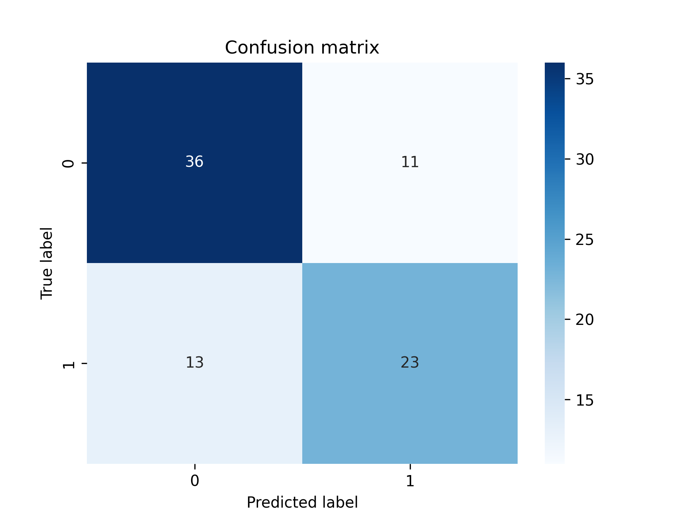
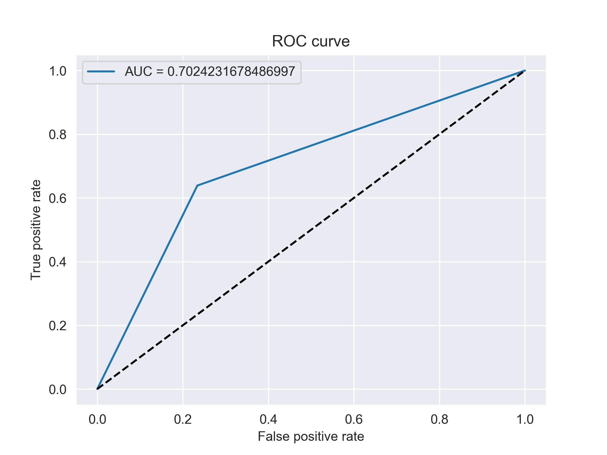

# Kidney_Stones_Classification

## Description
This is a personal project in which I build a CI/CD pipeline for a health classification solution.  
The goal is to predict whether a patient has kidney stones or not based on their urine analysis results 🩺

I build this project to practice my skills in data science, machine learning, data engineering and MLOps 💪.  
The project aims to use several tools such as Python, Pandas, Numpy, Scikit-learn, Git, GitHub, FastAPI, Streamlit, Docker and many AWS Services (IAM, ECR, ECS, EC2, Fargate, S3, CodePipeline, CodeBuild, CodeDeploy, Load Balancer, Elastic IP and Route 53).

PS: The trained ML model (under `FastAPI_Backend/src/main.py`) has no hyperparameters tuning because this project is more about building the CI/CD pipeline rather than training the best ML model.

## Table of Contents
- [Local installation](#local-installation)
- [Usage](#usage)
- [Progress status](#progress-status)
- [Backend cloud deployment](#whats-in-my-backend-cloud-deployment-)
- [ML model's performances](#ml-models-performances)
- [Contributing](#contributing)

## Local installation
To install and run this project on your local machine, follow these steps :

1. Clone this repository to your local machine using `git clone https://github.com/timdgn/Kidney_Stones_Classification.git`
2. Navigate to the project directory using `cd Kidney_Stones_Classification`
3. (Optional) Install the required Python packages in your favorite virtual environment using `pip3 install -r requirements.txt`
4. Build the Docker images and run detached containers using `docker-compose up -d --build`
5. Go to `http://localhost:8501` and test my app ✨

## Usage
1. Use the different sliders to simulate a patient's urine details.
2. Click the button at the bottom to diagnose the patient using the implemented ML model 👨‍⚕️

## Progress status
- ✅ EDA
- ✅ Building and evaluation of the ML model
- ✅ Local deployment with Docker
- ✅ Cloud deployment on AWS
- ✅ Building the Continuous Delivery pipeline
- 🚧 ...

## What's in my backend cloud deployment ?
For my MLOps AWS deployment, the following pipeline has been built :
1. Whenever a push/merge is done on the **GitHub** main branch, **AWS CodePipeline** is triggered.
2. **CodeBuild** pulls the latest GitHub repository version, builds 2 **docker** images (one for the **fastapi** backend and one for the **streamlit** frontend) and pushes them to **ECR**.
3. **CodeDeploy** pulls the two latest images from **ECR** and deploys them to **ECS Fargate**.
4. An **Application Load Balancer** is implemented to regulate the clients traffic, with an **Elastic IP** address to hold a static IP address.  

PS: A domain name could have been registered through **AWS Route 53**, but as this is only a temporary project, I do not need it.

## ML model's performances
As cited in the description, the model used and the hyperparameters are not optimized.  
It has been implemented only to provide a working inference at the end of the pipeline.  
Therefore, here are some infos about its performances:

## Contributing
Me & Myself
